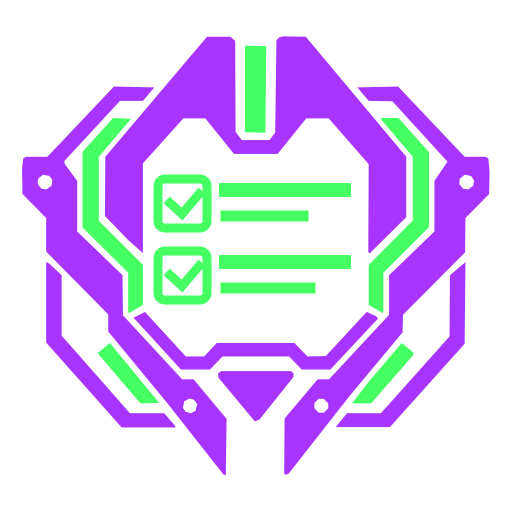

  

<h1 align="center">MECHA//TODO</h1>

  An ADHD-friendly, local-first todo PWA with lightweight XP, ranks, and pixel badges.

## About

MECHA//TODO is a personal todo list built around one short loop: capture a real task, complete it, receive XP once, see your progress, and leave the app.

The task list stays at the center. Progression adds immediate feedback without introducing currencies, inventories, streak penalties, or another system to maintain.

The planned interface draws from late-1990s mecha command systems while using original artwork and product language.

## Project status

MECHA//TODO is in the specification and ticket-writing phase. The repository currently contains the approved V1 implementation plan, earlier product handoff material, and visual assets. Application code has not been scaffolded yet.

The [implementation plan](IMPLEMENTATION_PLAN.md) is the current product and engineering contract. It takes precedence over the earlier [product handoff](docs/MECHA_TODO_IDEA_V4.md) where the two differ.

## Planned V1

- Add, edit, complete, reopen, and delete one-line todos.
- Keep a focused Active Bay with overflow in a Standby queue.
- Award XP only on a todo's first completion.
- Track levels, procedural ranks, and deterministic pixel badges.
- Store all user data locally in IndexedDB with no account or cloud sync.
- Work as a normal website and as an installable, offline-ready PWA.
- Support portable JSON backups, strict restore validation, and recovery tools.
- Provide keyboard, touch, swipe, reduced-motion, and forced-colors support.

## Planned stack

- Solid 2 and TypeScript
- Vite
- Tailwind CSS
- IndexedDB through `idb`
- Valibot
- Playwright

The implementation plan pins the initial dependency versions and defines the compatibility checks required before application work begins.

## Product boundaries

V1 has one local user per browser profile and origin. It has no backend, authentication, analytics, telemetry, advertising, or third-party runtime requests. Separate devices do not sync. Users can move data between installations with JSON backups.

The interaction design may be described as ADHD-friendly or ADHD-oriented. The project does not claim to treat ADHD or provide a clinical benefit.

## Development

Setup and development commands will be added after the application scaffold exists.

Implementation tickets live as local Markdown files under `.scratch/`. This repository does not use an external issue tracker for specifications or implementation work.
