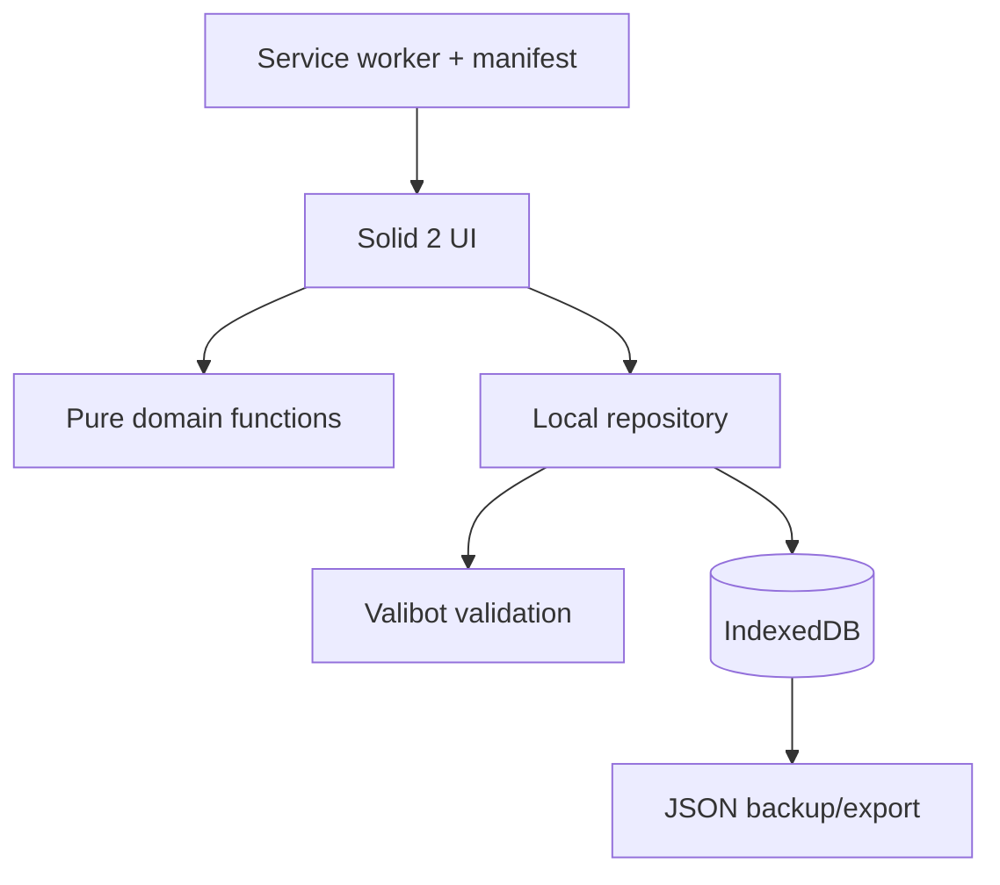

# TASK//MARCH — Product & Engineering Handoff V4

> **Working title:** `TASK//MARCH`  
> **Alternative title:** `DO//SCEND`  
> **Project codename:** Mecha Todo  
> **Reference platform:** mobile-first web app with optional installable PWA enhancement  
> **Reference implementation:** Vite + Solid 2 RC + TypeScript + Tailwind CSS v4 + Valibot + IndexedDB via `idb`

---

## 1. Product definition

Build an intentionally small, single-user todo application with one core interaction:

1. capture a todo;
2. complete it;
3. receive XP;
4. level up;
5. climb an effectively unlimited military/mecha rank hierarchy.

The actual todo list must stay simpler than the gamification wrapped around it. The product should feel like a compact command interface from a late-1990s biomecha / military-anime control room: dark near-black surfaces, purple structure, acid-green status accents, terse system labels, monospace typography, angular geometry, restrained movement, and a strong sense of systems/status without becoming visually noisy.

The visual direction may be clearly inspired by *Neon Genesis Evangelion*, but the app must **not** copy NERV/SEELE logos, character art, exact UI frames, proprietary type treatments, unit names, screenshots, or other protected franchise assets. Treat Evangelion as visual-language inspiration, not product branding.

### Product sentence

> A zero-friction mobile todo list wrapped in a restrained mecha-command progression system: complete real tasks, gain XP, level up, earn ranks, and leave the app.

### Core product principle

> **Reward the action, then get out of the way.**

A completion should feel satisfying for roughly 0.5–0.9 seconds, then visual attention should return to the remaining task list.

---

## 2. Design thesis: ADHD-oriented without becoming another distraction

The app should be described as **ADHD-friendly / ADHD-oriented interaction design**, not ADHD treatment.

Research around ADHD and reward processing is nuanced, but several observations are relevant to this design: immediate feedback can be more salient than delayed rewards; visible progress can increase persistence; streaks can increase continued engagement when intact, while broken streaks can become demotivating; and gamification can increase engagement while also becoming a distraction if too many mechanics compete for attention.[^1][^2][^3][^4][^5]

Therefore the game layer must stay thin:

- todo capture is instant;
- no difficulty estimation before doing a task;
- completion feedback is immediate;
- progress is always visible but compact;
- early levels arrive quickly;
- there is no punishment for inactivity;
- there is no health/damage mechanic;
- there is no currency, inventory, equipment, loot, or random reward;
- there is no “streak broken” failure state;
- there is no requirement to maintain the game separately from the tasks;
- the user should spend less time inside the app because the app worked.

### Do not market the app as a dopamine hack

Avoid product copy such as:

- “dopamine on demand”;
- “fix your ADHD”;
- “hack your executive dysfunction”;
- “scientifically boosts dopamine.”

The app can use motivational design patterns without making clinical or neurochemical claims.

---

## 3. V1 scope

### Must exist in v1

- add a todo with one text field;
- active todo list;
- standby queue when active capacity is full;
- complete via checkbox/tap and swipe;
- delete via trailing swipe action/button;
- deleting a never-rewarded todo awards **0 XP**;
- first completion awards XP only once per todo;
- undo completion keeps the already-awarded XP temporarily and rechecking grants no second reward;
- deleting a todo that has previously earned XP revokes exactly the XP that todo earned;
- XP / level / rank HUD;
- level 0 starting state;
- first completed todo reaches level 1;
- rank changes every 5 levels;
- procedural infinite rank naming;
- daily continuity bonus;
- capped daily combo bonus;
- compact `+XP` / combo feedback;
- persistent local storage;
- normal HTTPS web app works fully without installation;
- optional installable PWA / offline app shell enhancement;
- persistent-storage request/status;
- JSON backup export and restore;
- schema-versioned migrations;
- responsive mobile-first UI;
- deterministic procedural pixel rank badge;
- desktop/tablet enhancement without creating a separate desktop product.

### Explicit v1 non-goals

Do **not** add:

- accounts;
- multi-user support;
- cloud sync;
- Turso;
- Drizzle;
- server API routes;
- authentication;
- due dates;
- reminders;
- recurring tasks;
- projects/tags;
- priorities;
- subtasks;
- AI task decomposition;
- calendars;
- Pomodoro;
- social features;
- leaderboards;
- achievements;
- loot/currency/shops;
- avatars;
- health/damage;
- streak punishment;
- analytics dashboards;
- drag-and-drop sorting;
- native app wrapper unless browser durability testing proves the PWA insufficient.

---

## 4. Naming research and working-name recommendation

The name should feel like a compact system/codename rather than another cheerful productivity SaaS brand.

### Naming goals

The name should ideally be:

- short enough for a mobile header/icon label;
- readable in uppercase mono typography;
- compatible with styling such as `WORD//WORD`, `WORD.01`, `SYS//WORD`;
- suggest action, ascent, mission, rank, command, or pilot language;
- not directly copy Evangelion names such as NERV, SEELE, EVA, MAGI, etc.;
- not contain “ADHD” as a medical/product claim;
- not already be heavily used by task/productivity software.

### Collision scan — names to avoid

Several obvious options are already occupied:

| Candidate | Result | Decision |
|---|---|---|
| `TaskFrame` | Existing iOS task manager/productivity app | **Reject**[^41] |
| `Task Reactor` | Existing AI-agent product; also used by Snowflake | **Reject**[^42] |
| `Directive Zero` | Active NIS2 software/service name and game title | **Reject**[^43] |
| `Rankline` | Multiple current software/services | **Reject**[^44] |
| `Rankshift` | Current AI-search software product | **Reject**[^45] |
| `TaskShift` | Current browser automation / business products | **Reject**[^46] |
| `Mekado` | Established German company/name plus historical music use | **Reject**[^47] |
| `Sortask` | Current Austrian software/AI company | **Reject**[^48] |

This scan is deliberately practical rather than legal. It checks current web/product collisions; it is **not** trademark clearance.

### Shortlist

#### 1. `TASK//MARCH` — recommended working name

Repository/package-safe form:

```text
taskmarch
```

Display form:

```text
TASK//MARCH
```

Why it fits:

- `TASK` immediately explains the product;
- `MARCH` implies forward motion, rank, military cadence, and progression;
- works well with the rank ladder;
- easy to say and spell;
- exact-string research did not surface an obvious active todo/productivity product at the time of the naming scan;
- no direct Evangelion IP dependency.

Potential drawback: “march” is intentionally military and slightly stern. That is acceptable for this theme, but microcopy elsewhere should remain encouraging rather than authoritarian.

#### 2. `DO//SCEND` / `DOSCEND`

Repository/package-safe form:

```text
doscend
```

Display form:

```text
DO//SCEND
```

Concept:

```text
DO + ASCEND
```

This is the closest spiritual successor to the appeal of `adh-do`: a small wordplay that explains the mechanic without spelling everything out.

Pros:

- compact;
- progression is embedded in the name;
- visually excellent in the intended UI;
- exact-string searches did not surface a clear competing product.

Caution:

- it is visually/phonologically somewhat close to **DocSend**;
- pronunciation may be ambiguous (`do-send` vs `do-ascend`).

Use this if cleverness matters more than immediate semantic clarity.

#### 3. `PILOT//QUEUE`

Repository-safe:

```text
pilotqueue
```

Pros:

- strong mecha/pilot framing;
- maps neatly to Active Bay + Standby Queue;
- exact-string searches did not surface an obvious consumer productivity product.

Cons:

- sounds more like infrastructure/software engineering than a todo app;
- weak connection to leveling.

#### 4. `ASCEND//DO`

Repository-safe:

```text
ascenddo
```

Pros:

- clear upward progression;
- likely low collision;
- not franchise-dependent.

Cons:

- awkward spoken rhythm;
- less memorable than `DO//SCEND`.

### Recommended naming decision for implementation

Use:

```ts
export const PRODUCT_NAME = "TASK//MARCH";
```

but keep it in **one config location only** so changing to `DO//SCEND` later does not require asset/text hunting.

Do **not** bake the working name permanently into database names, object-store names, or migration semantics.

Use a neutral internal DB name such as:

```ts
const DB_NAME = "mecha-todo";
```

until the public/product name is finalized.

---

## 5. Core interaction loop

The first real completion is the tutorial.

```text
OPEN APP
   │
   ▼
LV 000 · CADET
0 / 10 XP
ACTIVE 0 / 8
   │
   ├── type todo + Enter
   ▼
TODO APPEARS
   │
   ├── check / swipe right
   ▼
COMPLETE
   │
   ├── mark row complete immediately
   ├── atomically persist completion + XP event
   ├── show +10 XP
   ├── first-ever task reaches LV 001
   ├── animate XP bar
   ├── move task to completed
   └── return attention to remaining tasks
```

No onboarding carousel is necessary.

The user learns:

```text
TASK → DONE → XP → LEVEL
```

by doing one task.

---

## 6. XP progression — no unexplained magic exponent

### 6.1 Base XP

```ts
export const TODO_BASE_XP = 10;
```

Every todo can award its base reward **once**.

Do not ask the user to choose task difficulty. Deciding whether “answer email” deserves 5 XP or 30 XP is itself additional executive work and creates a farming/optimization problem.

### 6.2 Design the curve from a fixed Level-100 anchor

The progression curve has one **fixed design anchor**:

> **Level 100 is always the reference level.**

Do not make that level configurable. The only progression tuning value should be the number of ordinary base-XP todos required to reach Level 100.

Initial tuning:

```ts
export const TODO_BASE_XP = 10;

// Product invariant. Do not expose this as a balancing knob.
const CURVE_ANCHOR_LEVEL = 100;

// The one intended curve-balancing knob.
export const TODOS_AT_LEVEL_100 = 500;
```

This means:

> Level 1 requires one ordinary todo, and Level 100 represents roughly **500 ordinary base-XP completions** before LINK/COMBO bonuses.

For cumulative threshold:

```text
XP(level) = BASE_XP × (1 + (level - 1)^p)
```

and because Level 100 is fixed:

```text
XP(100) = TODOS_AT_LEVEL_100 × BASE_XP
```

Therefore:

```text
1 + 99^p = TODOS_AT_LEVEL_100
p = ln(TODOS_AT_LEVEL_100 - 1) / ln(99)
```

At the initial value of `500`:

```text
p ≈ 1.352000883
```

The exponent is therefore **derived**, never configured directly.

### 6.3 Configuration

```ts
export const TODO_BASE_XP = 10;
const CURVE_ANCHOR_LEVEL = 100;
export const TODOS_AT_LEVEL_100 = 500;

export const XP_CURVE_EXPONENT =
  Math.log(TODOS_AT_LEVEL_100 - 1) /
  Math.log(CURVE_ANCHOR_LEVEL - 1);
```

Only this should normally be tuned:

```ts
TODOS_AT_LEVEL_100 = 400;
TODOS_AT_LEVEL_100 = 500;
TODOS_AT_LEVEL_100 = 650;
```

Do **not** tune:

```ts
CURVE_ANCHOR_LEVEL
XP_CURVE_EXPONENT
```

The first is a product invariant and the second is a derived implementation detail.

### 6.4 Cumulative XP threshold

```ts
export function totalXpForLevel(level: number): number {
  if (!Number.isInteger(level) || level < 0) {
    throw new RangeError("level must be an integer >= 0");
  }

  if (level === 0) return 0;

  return Math.round(
    TODO_BASE_XP *
      (1 + Math.pow(level - 1, XP_CURVE_EXPONENT)),
  );
}
```

Approximate base curve at the initial `TODOS_AT_LEVEL_100 = 500`:

| Level | Total XP threshold | Equivalent base-10 completions |
|---:|---:|---:|
| 0 | 0 | 0 |
| 1 | 10 | 1 |
| 2 | 20 | 2 |
| 3 | 36 | 3.6 |
| 4 | 54 | 5.4 |
| 5 | 75 | 7.5 |
| 10 | 205 | 20.5 |
| 20 | ~545 | ~54.5 |
| 50 | ~1,935 | ~193.5 |
| 100 | 5,000 | 500 |
| 1,000 | ~113,620 | ~11,362 |
| 1,000,000 | ~1.294 billion | stress-test target |

Actual task counts are lower because continuity/combo bonuses add XP.

### 6.5 Deriving level from lifetime XP

Do not loop one million levels.

The threshold function is monotonic, so use exponential upper-bound discovery + binary search:

```ts
export function levelForTotalXp(totalXp: number): number {
  if (!Number.isFinite(totalXp) || totalXp < TODO_BASE_XP) {
    return 0;
  }

  let low = 0;
  let high = 1;

  while (totalXpForLevel(high) <= totalXp) {
    high *= 2;
  }

  while (low + 1 < high) {
    const mid = Math.floor((low + high) / 2);

    if (totalXpForLevel(mid) <= totalXp) low = mid;
    else high = mid;
  }

  return low;
}
```

Derived HUD values:

```ts
type Progression = {
  totalXp: number;
  level: number;
  currentThreshold: number;
  nextThreshold: number;
  xpIntoLevel: number;
  xpNeededForNext: number;
  fraction: number;
  rank: Rank;
};
```

Never store `level` as authoritative persistence. Store XP events; derive level.

---

## 7. Reward model: base XP + LINK + COMBO

### 7.1 First-completion-only rule

Primary invariant:

> **A todo can earn its completion reward only once at a time, and deleting that rewarded todo must remove that reward from lifetime XP.**

Therefore:

- first completion → positive XP award;
- uncheck → XP is not immediately removed;
- recheck after undo → 0 additional XP;
- delete a todo that never earned XP → 0 XP;
- delete a todo that earned XP → append an equal negative XP adjustment/revocation;
- deleting cannot leave lifetime XP behind for a task that no longer exists in the user's task history.

This prevents checkbox farming while keeping accidental undo forgiving.

The app is single-user and self-motivation oriented, not an anti-cheat system. Do not retroactively recalculate an entire historical LINK/COMBO chain when a rewarded todo is deleted. Revoke the exact XP that todo originally contributed and preserve the historical audit trail.

### 7.2 Daily LINK continuity bonus

Recommended default:

```ts
export const DAILY_LINK_BONUS = 5;
```

Rule:

> If yesterday had at least one XP-eligible completion, the first XP-eligible completion today gets `+5 XP`.

Example:

```text
BASE       +10
LINK       +05
──────────────
TOTAL      +15 XP
```

The chain length can be displayed:

```text
LINK // 004
```

but chain length does not increase the bonus.

A 200-day chain still gives +5.

If one day is missed:

- no XP is removed;
- no rank is lost;
- no red failure banner;
- no “you broke your streak” copy;
- the next active day simply starts a new chain.

### 7.3 Daily combo bonus

Recommended initial tuning:

```ts
export const COMBO_BLOCK_SIZE = 5;
export const COMBO_XP_PER_TIER = 2;
export const COMBO_MAX_TIER = 4;
```

```ts
export function comboTier(dailyOrdinal: number): number {
  return Math.min(
    COMBO_MAX_TIER,
    Math.floor(dailyOrdinal / COMBO_BLOCK_SIZE),
  );
}

export function comboBonus(dailyOrdinal: number): number {
  return comboTier(dailyOrdinal) * COMBO_XP_PER_TIER;
}
```

Result:

| Completion today | Base | Combo | Total before LINK |
|---:|---:|---:|---:|
| 1–4 | 10 | 0 | 10 |
| 5–9 | 10 | +2 | 12 |
| 10–14 | 10 | +4 | 14 |
| 15–19 | 10 | +6 | 16 |
| 20+ | 10 | +8 cap | 18 |

Why fixed additive tiers rather than a multiplier?

An uncapped multiplier such as `1.1^combo` eventually turns progression into “split everything into tiny tasks and farm combo.” A capped additive system creates a little “one more task” pull without exploding the economy.

### 7.4 Combined reward

```ts
export function rewardForCompletion(input: {
  dailyOrdinal: number;
  hadCompletionYesterday: boolean;
}) {
  const baseXp = TODO_BASE_XP;

  const linkBonus =
    input.dailyOrdinal === 1 && input.hadCompletionYesterday
      ? DAILY_LINK_BONUS
      : 0;

  const dailyComboBonus = comboBonus(input.dailyOrdinal);

  return {
    baseXp,
    linkBonus,
    comboBonus: dailyComboBonus,
    totalXp: baseXp + linkBonus + dailyComboBonus,
  };
}
```

### 7.5 Snapshot reward values

Persist the exact reward that was awarded:

```text
baseXp
linkBonus
comboBonus
totalXp
dailyOrdinal
comboTier
streakDays
dayKey
awardedAt
```

If combo tuning changes six months later, historical XP must not recalculate itself.

---

## 8. Calendar-day semantics

V1 uses the **device's current local calendar**. There is no stored reward timezone and no timezone selector.

The rule is intentionally human and simple:

> If the user's device says the date has changed, TASK//MARCH considers it a new day.

At each completion:

```ts
const now = new Date();

const dayKey = [
  now.getFullYear(),
  String(now.getMonth() + 1).padStart(2, "0"),
  String(now.getDate()).padStart(2, "0"),
].join("-");
```

Examples:

```text
2026-09-11 23:59 device-local → old day
2026-09-12 00:00 device-local → new day
```

If the user travels and the device timezone changes, the app follows the device. This is acceptable and preferable to maintaining a separate application timezone for a single-user local-first todo app.

Each XP interaction stores the `dayKey` that was true **when the interaction happened**. Historical records are not rewritten when the device timezone later changes.

Do not use UTC date slicing such as:

```ts
new Date().toISOString().slice(0, 10)
```

for reward-day boundaries, because that can disagree with the calendar day visible on the user's phone.

---

## 9. Procedural rank model

### 9.1 Base ladder

A new rank begins every 5 levels.

| Level | Rank |
|---:|---|
| 0–4 | Cadet |
| 5–9 | Trooper |
| 10–14 | Sergeant |
| 15–19 | Lieutenant |
| 20–24 | Captain |
| 25–29 | Major |
| 30–34 | Colonel |
| 35–39 | General |
| 40–44 | Marshal |

This intentionally means:

```text
LV 000 = CADET
LV 005 = TROOPER
```

### 9.1.1 Why this rank order

This is a **fictionalized progression ladder**, not an attempt to reproduce one real military's rank table exactly.

The middle of the ladder borrows the intuitive responsibility progression found in real army structures: Sergeant is an experienced enlisted leader; Lieutenant is the entry commissioned-officer tier; Captain typically commands a company-sized unit; Major moves toward higher staff/operational responsibility; Colonel commonly commands larger formations; General is senior strategic command. Current U.S. Army references place Lieutenant → Captain → Major → Lieutenant Colonel → Colonel → General grades in increasing officer seniority.[^50]

TASK//MARCH deliberately simplifies that structure:

| Rank | Intended meaning in the app | Why it sits here |
|---|---|---|
| **Cadet** | trainee / not yet operational | Perfect Level-0 state: the user has entered the system but has not completed a mission yet. |
| **Trooper** | ordinary operational soldier/pilot | `Trooper` broadly means a soldier and is more thematic than `Private`; Level 5 marks the first real promotion into active service.[^51] |
| **Sergeant** | experienced field leader | First obvious leadership step and a familiar bridge from rank-and-file to responsibility. |
| **Lieutenant** | junior commissioned command | Signals crossing from experienced operator into formal command. |
| **Captain** | unit commander | Strong, immediately understandable mid-rank milestone. Real Army captains commonly command company-sized units.[^52] |
| **Major** | senior operations/staff officer | Feels broader and more strategic than Captain; real Army majors serve as primary staff officers at brigade/task-force level.[^52] |
| **Colonel** | large-unit commander | A clear senior-command step immediately below general-officer territory; real Army colonels commonly command brigades.[^52] |
| **General** | top conventional strategic command | The recognizable summit of ordinary military hierarchy. |
| **Marshal** | supra-general / legendary theater commander | Used here as the final base-rank fantasy/mecha apex before procedural prestige titles begin. It is intentionally more stylized than the preceding ranks. |

Why omit ranks such as Corporal, Staff Sergeant, Lieutenant Colonel, Brigadier General, Major General, and Lieutenant General?

Because the app only promotes every five levels and the ladder should be memorable at a glance. Reproducing every real rank would create too many near-duplicate labels and dilute the feeling of each promotion. The chosen sequence keeps the **shape** of increasing responsibility without pretending to be a real military personnel system.

### 9.2 Infinite prestige naming

After the base ladder reaches Marshal, continue procedurally.

Prestige atoms:

```ts
export const PRESTIGE_ATOMS = [
  "Prime",
  "Vanguard",
  "Apex",
  "Ascendant",
  "Sovereign",
  "Stellar",
  "Omega",
  "Eternal",
] as const;
```

These are deliberately chosen so every atom can precede `Marshal` without becoming grammatically nonsensical:

```text
Prime Marshal
Vanguard Marshal
Apex Marshal
Sovereign Marshal
Eternal Marshal
```

Generate combinations with bijective-base encoding so there is no final title.

Conceptually:

```text
Marshal
Prime Marshal
Vanguard Marshal
...
Eternal Marshal
Prime-Prime Marshal
Prime-Vanguard Marshal
...
```

The algorithm can encode any positive prestige index using the finite atom alphabet, like spreadsheet columns use `A..Z, AA..`.

### 9.3 Rank function

```ts
export const LEVELS_PER_RANK = 5;

export const BASE_RANKS = [
  "Cadet",
  "Trooper",
  "Sergeant",
  "Lieutenant",
  "Captain",
  "Major",
  "Colonel",
  "General",
  "Marshal",
] as const;
```

Pseudo:

```ts
rankIndex = Math.floor(level / 5)

if rankIndex < BASE_RANKS.length:
  title = BASE_RANKS[rankIndex]
else:
  prestigeIndex = rankIndex - BASE_RANKS.length + 1
  prefix = encodeBijective(prestigeIndex, PRESTIGE_ATOMS)
  title = `${prefix} Marshal`
```

### 9.4 Extreme-level mobile display

The canonical rank must never be truncated in data/accessibility, but UI can create a compact rendering.

For short rank:

```text
LV 042
MARSHAL
```

For medium rank:

```text
LV 240
PRIME-VANGUARD
MARSHAL
```

For absurd rank:

```text
LV 1000000
SOVEREIGN…ETERNAL
MARSHAL
```

Rules:

- canonical title remains available in `aria-label` / details panel;
- compact title may show first + last atom with ellipsis;
- never shrink font until unreadable;
- `LV` and XP progress are more important than rendering every generated word;
- the badge becomes the visual identity for very deep prestige, reducing dependence on title length.

---

## 10. Procedural pixel badges — required for v1

The first usable implementation can be built before badges, but the **first public/live v1 must include them**. Implement badges late in the v1 sequence, after persistence, todo actions, progression, rewards, responsive interaction, backup/recovery, and core E2E coverage are stable.

Badge generation should be deterministic from rank state:

```text
rank + prestige atoms + levelWithinRank
                │
                ▼
        badge descriptor
                │
                ▼
        pixel-style SVG
```

### Base-rank silhouette

Each base rank owns a silhouette family:

```text
Cadet       single bar / chevron
Trooper     twin chevron
Sergeant    stepped chevron
Lieutenant  narrow diamond
Captain     double diamond
Major       winged diamond
Colonel     shield + bars
General     star / wing form
Marshal     heavy crest
```

### Level-within-rank

`level % 5` adds small pips/segments:

```text
0  no pip
1  one pip
2  two pips
3  three pips
4  four pips
```

### Prestige atoms as modifiers

Example mapping:

```text
Prime      center highlight
Vanguard   forward side fins
Apex       upper spike
Ascendant  vertical extension
Sovereign  crown pixels
Stellar    star pixels
Omega      enclosing ring
Eternal    mirrored outer frame
```

For a rank with many atoms, do not continuously make the SVG larger. Use the first few modifiers directly, then hash remaining atoms deterministically into:

- secondary pixel positions;
- border pattern;
- accent arrangement;
- tiny glyph matrix.

Same rank always generates the same badge.

No image generation or downloaded badge assets are necessary.

---

## 11. Active Bay: limit visible work without blocking capture

A hard “you may only create eight todos” rule is dangerous because capture itself is valuable. If a thought appears, the app should accept it immediately.

Instead split open todos into:

```text
ACTIVE BAY
STANDBY
```

### Initial capacities

| Rank threshold | Active capacity |
|---|---:|
| Cadet | 8 |
| Trooper | 9 |
| Sergeant | 10 |
| Lieutenant | 11 |
| Captain | 12 |
| Major | 13 |
| Colonel | 14 |
| General | 15 |
| Marshal+ | 16 cap |

This is a product-design heuristic, not a clinical ADHD number. WIP limits are useful as a focus/context-switching analogy, but there is no evidence that “8” is the scientifically correct number of todos for ADHD.[^6]

### Behavior

If Active Bay has space:

```text
new todo → active
```

If Active Bay is full:

```text
new todo → standby
```

UI:

```text
ACTIVE // 8 / 8

[ eight visible active tasks ]

STANDBY // 04   ▸
```

Standby is collapsed by default.

When an active task completes/deletes:

```text
oldest standby task → active
```

This provides a tiny progression reward beyond XP: higher rank slowly expands how much active work the “pilot” is allowed to operate.

Do not let capacity exceed 16 in v1. The goal is not to unlock a 200-item active list.

---

## 12. Mobile-first UI

### 12.1 Phone is the reference design

Design at approximately 360–430 CSS px first.

Desktop should look like the phone interface placed inside a wider command surface, not like a completely different productivity dashboard.

### 12.2 Reference phone layout

```text
┌──────────────────────────────────┐
│ TASK//MARCH                LV 014 │
│ SERGEANT                         │
│ ███████████░░░░░  188 / 205 XP  │
│ LINK 04              ACTIVE 7/10 │
├──────────────────────────────────┤
│                                  │
│ ○ send invoice                   │
│ ○ buy filters                    │
│ ○ answer mail                    │
│ ○ laundry                        │
│                                  │
│ STANDBY // 03                 ▸   │
│                                  │
│ COMPLETED // 05              ▸   │
│                                  │
├──────────────────────────────────┤
│ +  ADD DIRECTIVE...              │
└──────────────────────────────────┘
```

The composer should be reachable by thumb and stay near the bottom.

### 12.3 Swipe gestures

Recommended convention:

```text
swipe right  → complete / restore
swipe left   → reveal delete
```

Do **not** full-swipe delete.

Deletion is destructive and grants no XP. Require either:

- swipe left → tap Delete; or
- visible overflow/delete action.

Swipe is an enhancement, never the only way to perform the action. Preserve checkbox/button controls for accessibility and desktop.

Apple’s list conventions commonly put state/positive actions on the leading edge and destructive actions on the trailing edge; this is a useful cross-platform mental model even though the app is web-based.[^7][^8]

### 12.4 Completion feedback

Normal:

```text
+10 XP
```

Link:

```text
+15 XP
LINK // 004
```

Combo:

```text
+12 XP
COMBO // 05
```

Both:

```text
+17 XP
LINK // 004 · COMBO // 05
```

Keep the secondary line smaller and dimmer.

### 12.5 Level/rank events

Normal completion: ~500–700 ms.

Level up: allow ~800–1100 ms accent pulse in HUD, but do not block interaction.

Rank up: slightly stronger, but still non-modal.

Never use a full-screen “LEVEL UP!” overlay that prevents checking the next task.

---

## 13. Visual language

### Theme

Use an original mecha command-console language:

```text
background      near black
surface         dark purple-black
primary         EVA-like deep purple family
status          acid / electric green
warning         amber
critical/delete muted red
text            off-white
muted           gray-lilac
```

Do not copy exact franchise color specifications if a public release is intended; build an original palette in the same family.

### Typography

Primary UI:

```text
monospace / technical sans-mono
```

Requirements:

- excellent digits;
- readable uppercase;
- compact width;
- good rendering on Android/iOS;
- preferably system/local fallback to avoid heavy webfont cost.

Potential stack:

```css
font-family:
  ui-monospace,
  "SFMono-Regular",
  "Cascadia Code",
  "Roboto Mono",
  "Liberation Mono",
  monospace;
```

A custom font can be evaluated later, but v1 does not need a font download to prove the product.

### Shapes

Prefer:

- square/2px corners;
- clipped/angled corners;
- 1px borders;
- thin grid lines;
- labels such as `SYS`, `LINK`, `ACTIVE`, `STANDBY`;
- no glassmorphism;
- no giant rounded SaaS cards;
- no gradients unless subtle and essential.

---

## 14. Stack decision V4

The app is now explicitly:

- one user;
- one primary phone;
- local-first;
- no required sync;
- tiny dataset;
- one main screen;
- experimental Solid 2 project.

That changes the architecture substantially.

### Recommended v1 stack

```text
Vite
Solid 2 RC
TypeScript
Tailwind CSS v4
Valibot
idb
vite-plugin-pwa
```

No backend.

No ORM.

No hosted DB.

No API client.

No auth.

### Why plain Vite still wins

As of this revision Solid 2 is in RC, while stable SolidStart v2 still targets Solid 1; TanStack Start supports the Solid 2 line but is itself RC.[^9][^10][^11]

For a single-screen local application, adding a full-stack meta-framework would solve problems the app no longer has.

The smallest architecture is now also the easiest to understand:



### Styling

Use Tailwind v4 for utility composition and a tiny CSS-first token layer.

Do not install shadcn merely to copy `globals.css`.

Create semantic variables directly:

```css
@import "tailwindcss";

:root {
  --bg: ...;
  --surface: ...;
  --text: ...;
  --muted: ...;
  --primary: ...;
  --status: ...;
  --danger: ...;
  --warning: ...;
}
```

Tailwind v4 supports CSS-first theme configuration, so a component library is unnecessary for v1.[^12]

---

## 15. Storage decision: persistent local database, not temporary browser state

This section is a **hard product requirement**.

### 15.1 Do not use these as the primary database

Do not use:

```text
sessionStorage
in-memory Solid store only
Cache API as data storage
service-worker cache as data storage
```

`localStorage` is persistent across normal browser restarts, but it is synchronous and string-only. It is fine for tiny preferences, but not the primary structured persistence layer here.[^13]

### 15.2 Use IndexedDB

IndexedDB is intended for persistent structured browser data and works offline.[^14]

Use the tiny `idb` wrapper rather than raw IndexedDB. `idb` is approximately 1.19 kB Brotli and closely mirrors IndexedDB while giving a much saner Promise API.[^15]

Choose `idb`, not `idb-keyval`, for V3 even though `idb-keyval` can be smaller (~295 B for get/set). V3 now treats durability, migrations, indexes, and atomic multi-store transactions as first-class requirements; `idb` is worth the ~1 kB.[^16]

### 15.3 Browser storage has two durability modes

Browser-origin data is generally **best effort by default**. Under storage pressure a browser may evict best-effort origins. Sites can request persistent storage using:

```ts
await navigator.storage.persist();
```

and inspect status with:

```ts
await navigator.storage.persisted();
```

When persistence is granted, the browser should not automatically evict that origin merely to free storage; explicit user actions can still delete it.[^17][^18]

### 15.4 Safari's seven-day rule matters

Safari/WebKit has a privacy rule that can delete script-writeable storage after seven days of Safari use without user interaction for ordinary websites. This includes IndexedDB and LocalStorage.[^19]

However, WebKit explicitly exempts the **first-party domain of a Home Screen web application** from the ITP seven-day storage cap, and keeps Home Screen web-app website data isolated from Safari.[^20]

Therefore the PWA install is not merely aesthetic on iPhone/iPad: it is part of the durability strategy.

### 15.5 Durability requirement

V1 must:

1. use IndexedDB;
2. ship as an installable `display: standalone` PWA;
3. request persistent storage;
4. verify whether persistence was granted;
5. expose storage status in Settings;
6. provide backup export/import from the beginning;
7. never silently wipe data during migration;
8. never call `deleteDB()` as an automatic recovery strategy.

### 15.6 Be explicit about what local-only can and cannot guarantee

Even persistent IndexedDB cannot survive every scenario.

Data can still disappear if the user:

- clears site/app data manually;
- uninstalls and removes associated app data;
- resets/replaces the device;
- loses the phone;
- encounters rare corruption/browser bugs.

Therefore:

> **Persistent local storage protects normal use and automatic eviction; external backup protects catastrophic loss.**

If “never lose this data even when the phone dies” becomes a hard requirement, optional cloud/file backup must be added. A purely local architecture cannot mathematically guarantee survival of device loss.

---

## 16. Web-app-first / PWA-enhanced durability behavior

TASK//MARCH is a **web app at heart**.

It must work correctly when opened as a normal HTTPS website in Chrome, Firefox, Safari, or another modern browser. Installation is never required for the core todo/progression experience.

The PWA layer adds:

- Home Screen/app installation;
- standalone display mode;
- offline application shell;
- improved mobile launch ergonomics;
- an important durability benefit on Safari/iOS.

WebKit's normal Safari browsing context can purge script-writeable storage after seven days without user interaction, but the first-party domain of a Home Screen web application is explicitly exempt from that ITP seven-day cap.[^19][^20] Therefore installation is an **optional enhancement with a real durability advantage**, not a separate product architecture.


### 16.1 Manifest

Minimum:

```json
{
  "name": "TASK//MARCH",
  "short_name": "TASK//MARCH",
  "display": "standalone",
  "start_url": "/",
  "scope": "/",
  "theme_color": "#...",
  "background_color": "#..."
}
```

Use `vite-plugin-pwa`, which supports Vite and SolidJS and can generate the app manifest/service worker/offline shell.[^21]

### 16.2 Persistence bootstrap

On application initialization:

```ts
export async function getStorageDurability() {
  const supported = Boolean(navigator.storage?.persisted);

  if (!supported) {
    return { supported: false, persistent: false };
  }

  const alreadyPersistent = await navigator.storage.persisted();

  if (alreadyPersistent) {
    return { supported: true, persistent: true };
  }

  const granted = await navigator.storage.persist();

  return {
    supported: true,
    persistent: granted,
  };
}
```

Do not repeatedly request persistence on every render.

Recommended timing:

- initialize DB immediately;
- after first meaningful interaction / PWA install, request persistence;
- re-check status in Settings.

### 16.3 Storage status UI

Do not clutter the todo screen with a permanent warning.

Settings can show:

```text
DATA STORAGE

LOCAL DB       ONLINE
PERSISTENCE    PROTECTED
LAST BACKUP    12 DAYS AGO
```

or:

```text
PERSISTENCE    BEST EFFORT
[ PROTECT DATA ]
```

If persistence is unavailable/denied, explain plainly:

> Local data is saved, but this browser has not granted protected storage. Install the app and create a backup to reduce data-loss risk.

No scary red alarm unless data actually failed to save.

---

## 17. IndexedDB model

Use object stores rather than one giant JSON blob.

Benefits:

- atomic updates;
- unique XP-per-todo constraint;
- safer migrations;
- smaller writes;
- easier history queries;
- explicit data ownership;
- recovery is easier than one corrupt monolithic document.

### 17.1 Store: `todos`

```ts
type TodoRecord = {
  id: string;
  text: string;
  openState: "active" | "standby";
  createdAt: number;
  updatedAt: number;
  completedAt: number | null;
  deletedAt: number | null;
};
```

Key path:

```text
id
```

Useful indexes:

```text
by-created-at
by-open-state
by-completed-at
by-deleted-at
```

### 17.2 Store: `xpEvents`

`xpEvents` is **not a static lookup table and not a file bundled with the application**.

It is the user's local XP ledger. It changes in response to user interaction.

Examples:

```text
complete todo A     → +10 completion event
complete todo B     → +15 completion event (base + LINK)
delete rewarded A   → -10 revocation event referencing A's award
```

Why keep a ledger instead of only storing `totalXp`?

- exact historical awards survive future reward-formula changes;
- deleting a rewarded todo can revoke the exact amount it earned;
- uncheck/recheck cannot accidentally double-award;
- backup/restore can reproduce progression exactly;
- debugging corrupted progression is possible;
- lifetime XP is simply the sum of event deltas;
- no giant level/rank lookup file is needed.

The table is tiny for this use case: one or occasionally two rows per rewarded todo.


```ts
type XpEventRecord = {
  id: string;
  todoId: string;

  kind: "completion" | "revocation";

  // Positive for completion, negative for revocation.
  xpDelta: number;

  // Completion reward snapshot. Null/0 for revocation rows where not useful.
  baseXp: number;
  linkBonus: number;
  comboBonus: number;
  dailyOrdinal: number | null;
  comboTier: number | null;
  streakDays: number | null;

  // Local device calendar day when THIS ledger interaction happened.
  dayKey: string;
  createdAt: number;

  // Revocation rows point at the positive completion event they cancel.
  reversesEventId: string | null;
};
```

Indexes:

```text
by-todo-id         unique
by-day-key
by-awarded-at
by-day-ordinal     compound [dayKey, dailyOrdinal], unique
```

The unique `by-todo-id` index is the anti-farming invariant.

### 17.3 Store: `days`

```ts
type DayRecord = {
  dayKey: string;
  completionCount: number;
  streakDays: number;
  updatedAt: number;
};
```

Key path:

```text
dayKey
```

This makes daily LINK/combo updates simple and transactional.

### 17.4 Store: `meta`

Key/value records for:

```text
settings
schemaVersion
createdAt
lastBackupAt
installId
```

Do not store derived level/rank here as authoritative state.

### 17.5 Optional store: `recoverySnapshots`

Keep a small rotating set, e.g. latest 5 snapshots.

Purpose:

- protect against application-level bugs;
- allow migration/import rollback.

It does **not** protect against origin eviction/device loss because it lives in the same browser origin.

Do not pretend it is an external backup.

---

## 18. Opening and migrating IndexedDB

Example shape:

```ts
import { openDB, type DBSchema } from "idb";

interface MechaTodoDB extends DBSchema {
  todos: {
    key: string;
    value: TodoRecord;
    indexes: {
      "by-created-at": number;
      "by-open-state": string;
      "by-completed-at": number;
    };
  };

  xpEvents: {
    key: string;
    value: XpEventRecord;
    indexes: {
      "by-todo-id": string;
      "by-day-key": string;
      "by-awarded-at": number;
      "by-day-ordinal": [string, number];
    };
  };

  days: {
    key: string;
    value: DayRecord;
  };

  meta: {
    key: string;
    value: unknown;
  };
}
```

Migration rule:

> **Unknown data is a recovery problem, never a reason to wipe the DB.**

Never implement:

```ts
catch {
  await deleteDB(DB_NAME);
  recreateEverything();
}
```

That is unacceptable for this app.

### Upgrade rules

- increment DB version deliberately;
- migrations run inside the IndexedDB version-change transaction;
- prefer additive changes;
- copy/transform records when necessary;
- if upgrade fails, abort the transaction;
- surface a recovery screen;
- preserve the old database where the platform permits;
- always allow export of readable data before destructive recovery.

For a future incompatible schema:

```text
OPEN OLD DATA
   │
   ├── validate
   ├── snapshot
   ├── migrate
   ▼
COMMIT
```

not:

```text
FAIL → DELETE EVERYTHING
```

---

## 19. Valibot role

Valibot is **not** the database.

It is the runtime trust boundary around:

- imported backups;
- persisted settings/meta values;
- migration inputs;
- user-entered todo text;
- recovery snapshots;
- future sync payloads if sync is added.

Valibot is a good fit because it is modular, dependency-free, and can start below ~700 bytes depending on imports.[^22]

Example:

```ts
import * as v from "valibot";

export const TodoSchema = v.object({
  id: v.string(),
  text: v.pipe(v.string(), v.trim(), v.minLength(1)),
  openState: v.picklist(["active", "standby"]),
  createdAt: v.number(),
  updatedAt: v.number(),
  completedAt: v.nullable(v.number()),
  deletedAt: v.nullable(v.number()),
});
```

Backup root:

```ts
export const BackupSchema = v.object({
  format: v.literal("mecha-todo-backup"),
  version: v.number(),
  exportedAt: v.number(),
  data: v.object({
    todos: v.array(TodoSchema),
    xpEvents: v.array(XpEventSchema),
    days: v.array(DaySchema),
    settings: SettingsSchema,
  }),
  digest: v.string(),
});
```

TypeScript types should be inferred from schemas where practical rather than maintained twice.

---

## 20. Atomic task/reward transactions

Because IndexedDB supports transactions, todo state and XP-ledger changes must commit atomically.

### 20.1 First completion

Stores:

```text
todos
xpEvents
days
```

Pseudo:

```text
BEGIN READWRITE TRANSACTION

1. load todo
2. reject deleted/nonexistent todo
3. look for an active completion award for this todo

IF active award already exists:
    set completedAt if needed
    persist todo
    award 0 additional XP
    COMMIT

ELSE:
    derive device-local dayKey
    load/create DayRecord(today)
    dailyOrdinal = today's eligible completion count + 1
    calculate BASE + LINK + COMBO

    set todo.completedAt = now
    append positive xpEvent(kind="completion", xpDelta=reward.totalXp)
    update today's DayRecord

COMMIT
```

### 20.2 Undo / uncheck

Undo is intentionally forgiving:

```text
todo.completedAt = null
XP ledger unchanged
```

Why?

- accidental taps should not cause a distracting XP animation in reverse;
- a task may genuinely need reopening;
- rechecking produces **0 additional XP** because the active completion award already exists.

The UI may briefly say:

```text
TASK REOPENED
XP HELD
```

rather than `-XP`.

### 20.3 Delete

Deletion itself never earns XP.

If the todo has **never** been rewarded:

```text
soft-delete todo
XP delta = 0
```

If the todo has a positive completion award that has not already been reversed:

```text
soft-delete todo
append xpEvent:
  kind = "revocation"
  xpDelta = -originalAward.xpDelta
  reversesEventId = originalAward.id
```

This fixes the edge case:

```text
complete → receive XP → undo → never do it → delete
```

The final lifetime XP contribution of that todo becomes zero.

Do not mutate or erase the original completion event; preserve the ledger.

### 20.4 Historical LINK/COMBO behavior after revocation

Do **not** recursively recompute old daily combo tiers or streak chains after deletion.

Example:

```text
Monday todo produced +15
Tuesday reward was influenced by Monday activity
Thursday user deletes Monday todo
```

Thursday revokes the exact XP Monday's todo earned. Tuesday's historical reward remains as originally awarded.

This is intentionally a motivational app, not a competitive anti-cheat economy. Recursive historical recalculation would create surprising cascading XP changes and much more complexity for negligible benefit in a single-user application.

### 20.5 Deleted todo recovery

V1 does not need a user-facing trash/restore workflow.

Use soft deletion internally so recovery/export remains possible, but do not expose repeated delete/restore/reward cycles in normal interaction.

---

## 21. Repository abstraction

Do not let components call IndexedDB directly.

Define one local repository boundary:

```ts
export interface AppRepository {
  initialize(): Promise<void>;
  getState(): Promise<AppState>;
  addTodo(text: string): Promise<TodoRecord>;
  completeTodo(id: string): Promise<CompletionResult>;
  uncompleteTodo(id: string): Promise<void>;
  deleteTodo(id: string): Promise<void>;
  exportBackup(): Promise<BackupFile>;
  importBackup(file: unknown): Promise<ImportResult>;
}
```

Implementation:

```text
IndexedDbRepository
```

Why do this if there is only one database?

Because it keeps the UI/domain clean and makes future optional sync possible without rewriting task components.

Future:

```text
IndexedDbRepository       v1
SyncedRepository          later
NativeSqliteRepository    later if native wrapper becomes necessary
```

---

## 22. Backup and restore — part of v1, not a later nice-to-have

Given that the app intentionally has no server copy, backup must ship with the initial usable version.

### 22.1 Backup format

Filename:

```text
taskmarch-backup-2026-09-09.json
```

Suggested payload:

```json
{
  "format": "mecha-todo-backup",
  "version": 1,
  "exportedAt": 1788962400000,
  "appVersion": "0.1.0",
  "data": {
    "todos": [],
    "xpEvents": [],
    "days": [],
    "settings": {}
  },
  "digest": "sha256:..."
}
```

Generate digest with Web Crypto so accidental corruption can be detected.

### 22.2 Mobile export behavior

Preferred:

1. build JSON `Blob`/`File`;
2. if `navigator.canShare({ files })` supports it, open the system share sheet;
3. otherwise trigger a normal file download.

This lets a phone user save the backup to:

- Downloads;
- Google Drive;
- iCloud Drive;
- NAS/file app;
- another storage provider.

Do not require a proprietary cloud account.

### 22.3 Import behavior

Import must:

1. parse as unknown;
2. validate with Valibot;
3. verify backup format/version;
4. verify digest;
5. show a compact preview:

```text
132 TODOS
418 XP EVENTS
47 ACTIVE DAYS
BACKUP: 2026-09-09
```

6. create a local recovery snapshot of current data;
7. replace data inside one transaction;
8. re-derive progression;
9. confirm success.

Never merge blindly in v1. Replace is easier to reason about.

### 22.4 Backup reminder

Do not nag on the task screen.

Settings can show:

```text
LAST BACKUP // 31D
```

After meaningful usage, e.g. 50 completed todos, allow one subtle one-time suggestion:

```text
SECURE SAVE // CREATE BACKUP
```

No daily reminder.

---

## 23. Local recovery strategy

When something goes wrong, preserving data has priority over starting the app cleanly.

### Startup order

```text
open DB
  │
  ├── success → validate critical meta → app
  │
  └── failure
       │
       ▼
   RECOVERY MODE
       │
       ├── show error details in developer section
       ├── attempt read-only export where possible
       ├── offer import backup
       └── never auto-delete DB
```

If one malformed record is found, quarantine/skip that record only after preserving/exporting the raw value.

Do not turn one corrupt todo into total history loss.

---

## 24. Client state strategy

The DB is durable state; Solid state is the current UI projection.

Recommended flow:

```text
IndexedDB
   │ load
   ▼
Solid store/signals
   │ mutation command
   ▼
Repository transaction
   │ result
   ▼
update Solid UI
```

The database write should occur immediately during task mutation, not via a delayed “save every 30 seconds” buffer.

For completion:

1. visually move/check row immediately;
2. perform local IndexedDB transaction;
3. transaction typically completes essentially instantly;
4. show returned XP result;
5. on rare write failure, rollback visual state and show concise error.

There is no network latency, which makes the XP feedback loop particularly strong.

---

## 25. Suggested repository structure

```text
.
├─ public/
│  ├─ icons/
│  └─ ...
├─ src/
│  ├─ components/
│  │  ├─ AddTodo.tsx
│  │  ├─ ProgressHud.tsx
│  │  ├─ RewardToast.tsx
│  │  ├─ TodoItem.tsx
│  │  ├─ TodoList.tsx
│  │  ├─ StandbyList.tsx
│  │  └─ SettingsSheet.tsx
│  │
│  ├─ domain/
│  │  ├─ progression.ts
│  │  ├─ ranks.ts
│  │  ├─ rewards.ts
│  │  ├─ capacity.ts
│  │  └─ day-key.ts
│  │
│  ├─ persistence/
│  │  ├─ db.ts
│  │  ├─ schema.ts
│  │  ├─ repository.ts
│  │  ├─ migrations.ts
│  │  ├─ durability.ts
│  │  ├─ backup.ts
│  │  └─ recovery.ts
│  │
│  ├─ schemas/
│  │  ├─ todo.ts
│  │  ├─ xp-event.ts
│  │  ├─ day.ts
│  │  ├─ settings.ts
│  │  └─ backup.ts
│  │
│  ├─ state/
│  │  └─ app-store.ts
│  │
│  ├─ styles/
│  │  └─ app.css
│  │
│  ├─ App.tsx
│  └─ index.tsx
│
├─ tests/
│  └─ e2e/
│     ├─ todo-flow.spec.ts
│     ├─ rewards.spec.ts
│     ├─ progression.spec.ts
│     ├─ capacity.spec.ts
│     ├─ persistence.spec.ts
│     ├─ backup-recovery.spec.ts
│     ├─ responsive-swipe.spec.ts
│     ├─ badge.spec.ts
│     └─ stress.spec.ts
│
├─ vite.config.ts
├─ tsconfig.json
├─ package.json
└─ README.md
```

Framework-specific Solid code should stay primarily under `components` and `state`.

Progression/rank/reward functions should be pure TypeScript.

---

## 26. PWA/service-worker policy

The service worker caches **application assets**, not authoritative task data.

```text
service worker cache
    = JS/CSS/icons/shell

IndexedDB
    = todos/XP/history/settings
```

Never treat service-worker cache as a database.

Use a simple update strategy that does not unexpectedly destroy state.

When a new app version is available:

```text
UPDATE AVAILABLE
[ RELOAD ]
```

or auto-update only after confirming migrations are backward-safe.

Do not force-refresh while the user is entering a task.

---

## 27. Responsive behavior

### Phone

Reference implementation.

- sticky compact progression HUD;
- full-width todo rows;
- bottom composer;
- swipe gestures;
- collapsed completed/standby;
- settings via small icon/command button.

### Tablet

Keep the same layout, increase gutters/max width.

Optional:

```text
HUD on left/top
list centered
```

but do not create two-column complexity without need.

### Desktop

Max content width around 520–680 px.

Use the extra screen width for:

- breathing space;
- richer HUD placement;
- hover actions;
- optional always-visible completed/standby counts.

Do not expand the todo rows across a 1600 px monitor.

---

## 28. Accessibility

Must support:

- keyboard add/complete/delete alternatives;
- visible focus states;
- checkbox/button alternatives to swipes;
- sufficient contrast;
- reduced motion;
- screen-reader rank labels;
- `aria-live="polite"` for XP feedback;
- no status encoded solely by green/red;
- rank abbreviations retaining canonical accessible text.

For reduced motion:

```css
@media (prefers-reduced-motion: reduce) {
  /* disable reward translations/pulses; preserve state change */
}
```

Completion feedback can become a static `+12 XP` text update rather than animation.

---

## 29. Performance budget

This app should feel instantaneous on an ordinary phone.

Targets:

- no server round-trip for task actions;
- avoid large UI libraries;
- avoid icon packs if a few inline SVGs suffice;
- no animation dependency;
- no date library unless timezone logic genuinely requires one;
- lazy-load Settings/backup code if useful;
- keep initial JS aggressively small;
- IndexedDB operations should be tiny compared with paint/input time.

Relevant library sizes are intentionally small: `idb` is about 1.19 kB Brotli and Valibot can start below ~700 B depending on imported schema functions.[^15][^22]

---

## 30. Testing strategy — Playwright E2E only

Do **not** add Vitest, Jest, Testing Library, fake IndexedDB unit harnesses, or a parallel unit-test suite.

The project uses **Playwright only**.

The reasoning is pragmatic: the application is small, local-first, browser-storage-heavy, swipe/mobile-first, and its important failures happen where domain logic, IndexedDB, rendering, browser lifecycle, and user actions meet. Playwright can run the same suite across Chromium, Firefox, WebKit and mobile device emulations through projects.[^54][^55]

### 30.1 Required Playwright projects

At minimum:

```text
Mobile Chromium      primary development target
Mobile WebKit        iPhone/Safari behavior proxy
Desktop Chromium     responsive sanity
Desktop Firefox      cross-browser sanity
Desktop WebKit       additional WebKit coverage
```

Also add configuration projects/contexts for:

```text
prefers-reduced-motion
narrow phone viewport
large phone viewport
tablet-ish viewport
desktop viewport
```

Do not multiply every test across every project if CI time becomes wasteful. Mark a compact critical-flow suite for all projects and run exhaustive reward/progression scenarios on the primary Chromium project.

### 30.2 Core behavior scenarios

Test through the rendered app and real IndexedDB in the browser:

```text
fresh app → LV0 Cadet
first todo completion → LV1
LV4 → LV5 changes Cadet → Trooper
add / complete / undo / re-complete
re-complete grants no second XP
delete never-completed todo → 0 XP
complete → undo → delete → original XP revoked
delete completed rewarded todo → exact XP revoked
active-capacity overflow → Standby
opening slot promotes oldest Standby item
reload preserves todos / XP / level
new browser context starts clean
backup export → clear test origin → import → identical state
invalid backup rejected without destroying existing data
```

### 30.3 Day boundary tests

The app follows the **device/browser local timezone**.

Use Playwright browser contexts with explicit timezone IDs where supported and/or fake the browser clock for deterministic scenarios.

Verify:

```text
23:59 local → completion belongs to day A
00:00 local → next completion belongs to day B
first completion on B can receive LINK from A
changing test timezone changes the local calendar boundary
historical event dayKey does not mutate afterward
```

### 30.4 Progression/configuration tests

Run the UI/backup-seeded scenarios for multiple values of the one balancing knob:

```text
TODOS_AT_LEVEL_100 = 250
TODOS_AT_LEVEL_100 = 500   // production initial
TODOS_AT_LEVEL_100 = 1000
```

`CURVE_ANCHOR_LEVEL` must remain fixed at 100 in every configuration.

Where a production compile-time constant makes multi-config testing awkward, run Playwright against separate Vite test builds created with an explicit test-only build env that maps to `TODOS_AT_LEVEL_100`. Do not expose an end-user setting.

Verify for every configuration:

```text
LV0 threshold = 0
LV1 threshold = TODO_BASE_XP
LV100 threshold = TODOS_AT_LEVEL_100 × TODO_BASE_XP
thresholds are strictly increasing
level shown at an exact threshold is correct
progress bar near boundaries is clamped 0..1
```

### 30.5 High-level / stress scenarios

Stress progression without clicking a million checkboxes.

Use a valid generated backup fixture and import it through the same production import path used by users. The fixture may contain enough valid XP-ledger entries/deltas to place the app at a very high level.

Mandatory targets:

```text
Level 10,000       ordinary high-level rendering
Level 1,000,000    rank/progression stress target
```

Verify:

- level lookup completes quickly;
- no loop walks level-by-level;
- rank generation is deterministic;
- generated canonical rank is valid;
- compact mobile rank rendering does not overflow the viewport;
- procedural pixel badge renders deterministically;
- XP progress remains finite and sane;
- exporting and reimporting the stress fixture preserves the same level/rank.

If JavaScript `number` precision eventually becomes a real supported-range concern, define and test a maximum supported level explicitly rather than silently producing inaccurate thresholds.

### 30.6 Interaction/responsive tests

Playwright should cover:

- touch/swipe right complete;
- swipe left reveal delete;
- no destructive full-swipe delete;
- checkbox/button fallback actions;
- reduced-motion behavior;
- keyboard add/complete/delete;
- long generated rank on a narrow phone;
- badge at every base rank;
- prestige-badge modifier combinations;
- app remains usable without installation;
- manifest/service-worker presence where supported.

Playwright supports multiple browsers, mobile emulation, and project-specific configurations directly, which is why a second testing stack is unnecessary here.[^54][^55]


## 31. First-run experience

Do not show a tutorial carousel.

First screen:

```text
TASK//MARCH

LV 000
CADET
0 / 10 XP

NO ACTIVE DIRECTIVES

[ + ADD DIRECTIVE... ]
```

First add → normal task.

First completion:

```text
+10 XP
LEVEL // 001
```

This teaches progression.

After the user has demonstrated intent, quietly perform/request storage durability setup.

If installable and not installed, a later subtle prompt can say:

```text
LOCAL DATA // INSTALL APP FOR OFFLINE + STORAGE PROTECTION
```

Do not block the first task behind PWA installation.

---

## 32. Completion psychology

Priority order of signals:

1. **task state changed**;
2. **XP earned**;
3. **XP bar moved**;
4. **combo/link state if relevant**;
5. **level/rank milestone when relevant**.

Never invert this so the game animation becomes more salient than having completed the task.

### Goal-gradient usage

The XP bar should visibly communicate proximity to the next level. Progress research suggests perceived closeness to a goal can increase effort, and “small wins” can reinforce motivation.[^4][^5]

Keep the progress bar thin and permanently available.

Example:

```text
LV 014 · SERGEANT
████████████░░░░  78%
```

### Combo proximity

A tiny line may show:

```text
COMBO // 4 / 5
```

when one task away from a tier.

Do **not** show a permanent large daily target such as “YOU MUST DO 10 TASKS.”

---

## 33. Microcopy

Prefer system language with low emotional judgment.

Examples:

```text
ADD DIRECTIVE
ACTIVE BAY
STANDBY
COMPLETED
LINK
COMBO
LEVEL UP
RANK ADVANCE
DATA STORAGE
SECURE SAVE
RESTORE BACKUP
```

Avoid:

```text
YOU FAILED
STREAK LOST
LAZY DAY
YOU'RE FALLING BEHIND
MISSION FAILURE
```

Military/mecha theme should create identity, not shame.

---

## 34. Deployment

Vercel is now only a static host.

Flow:

```text
GitHub
  │
  ▼
Vercel build
  │
  ▼
static Vite assets + PWA manifest/service worker
```

No environment secrets are necessary for v1.

No serverless Functions are necessary for v1.

No Turso project is necessary for v1.

No recurring hosting/database cost is necessary beyond the chosen static host/domain.

The application continues working offline after its app shell has been installed/cached.

---

## 35. V1 acceptance criteria

### Functional

- [ ] starts at level 0 / Cadet;
- [ ] first newly completed todo reaches level 1;
- [ ] task can be added with keyboard/touch;
- [ ] task can be completed with checkbox/button;
- [ ] swipe-right can complete;
- [ ] swipe-left reveals delete;
- [ ] deleting a never-rewarded todo changes XP by 0;
- [ ] deleting a rewarded todo revokes exactly that todo's awarded XP;
- [ ] rechecking a previously rewarded todo never awards additional XP;
- [ ] unchecking alone does not remove XP;
- [ ] LINK bonus works from previous calendar day;
- [ ] combo increases every 5 daily completions and caps;
- [ ] rank changes every 5 levels;
- [ ] procedural ranks do not have a defined max;
- [ ] Active Bay capacity follows rank and caps at 16;
- [ ] overflow tasks enter Standby;
- [ ] standby auto-promotes when a slot opens;
- [ ] completed tasks are collapsed by default;
- [ ] long rank names remain usable on narrow screens;
- [ ] procedural pixel badge renders for every base rank and prestige rank.

### Web/PWA behavior

- [ ] all core features work as a normal non-installed web app;
- [ ] PWA installation is optional, not a prerequisite;
- [ ] installed mode adds offline shell/launch ergonomics and Safari durability benefits;

### Persistence/durability

- [ ] IndexedDB is authoritative storage;
- [ ] no primary todo data in sessionStorage;
- [ ] DB survives browser/app restart;
- [ ] PWA manifest uses standalone display;
- [ ] app requests/checks persistent storage;
- [ ] Settings exposes persistence status;
- [ ] storage failure is visible and does not pretend success;
- [ ] no code path automatically deletes/recreates DB after an error;
- [ ] schema migration is versioned;
- [ ] export backup works on phone;
- [ ] import validates with Valibot;
- [ ] import verifies backup format/digest;
- [ ] backup restore recreates progression exactly.

### Technical

- [ ] Vite + Solid 2 RC;
- [ ] Tailwind v4 with small custom token layer;
- [ ] `idb` for IndexedDB;
- [ ] Valibot for runtime schemas;
- [ ] `vite-plugin-pwa` for PWA shell;
- [ ] no Drizzle;
- [ ] no Turso;
- [ ] no API routes;
- [ ] no auth dependency;
- [ ] domain functions are framework-neutral;
- [ ] progression/reward/rank tests pass.

### UX

- [ ] reference design works at ~360 px width;
- [ ] adding a task is one field + one action;
- [ ] reward does not block further interaction;
- [ ] combo indicator is secondary to XP;
- [ ] task list remains the dominant visual content;
- [ ] desktop adds space, not complexity;
- [ ] reduced-motion path exists.

---

## 36. Codex/T3 implementation order

### Step 1 — scaffold the web app

Create:

```text
Vite
Solid 2
TypeScript
Tailwind v4
JetBrains Mono via @fontsource-variable/jetbrains-mono
```

The application is a normal web app first. Do not make core behavior depend on installation.

### Step 2 — domain logic

Implement:

```text
progression.ts
ranks.ts
rewards.ts
capacity.ts
day-key.ts
badge-descriptor.ts
```

Keep these deterministic and side-effect-light, but **do not add a unit-test framework**. They will be exercised through Playwright scenarios once the application surface exists.

### Step 3 — IndexedDB + repository

Install:

```text
idb
valibot
```

Create stores/indexes and repository commands.

Implement reward-ledger correctness before wiring completion UI:

```text
positive completion award
no duplicate reward on recheck
negative revocation when rewarded todo is deleted
```

### Step 4 — core mobile UI

Build:

```text
ProgressHud
TodoList
TodoItem
AddTodo
StandbyList
RewardToast
SettingsSheet
```

Use buttons/checkboxes first.

### Step 5 — progression/reward integration

Wire:

- Level 0 → Level 1 onboarding through first completion;
- rank changes every 5 levels;
- LINK;
- COMBO;
- undo/recheck semantics;
- deletion revocation;
- Active Bay / Standby behavior.

### Step 6 — durability + recovery

Implement:

```text
navigator.storage.persisted()
navigator.storage.persist()
storage status model
backup export
backup validation/import
migration recovery
```

A denied persistence request must not break the web app; it should surface a concise durability warning/recommendation.

### Step 7 — swipe + responsive interaction

Implement with Pointer Events directly unless a real need for a dependency emerges.

```text
swipe right → complete/reopen
swipe left  → reveal delete
```

No full-swipe destructive delete.

### Step 8 — Playwright E2E suite

Add **only** Playwright as the test framework.

Cover:

- core todo flow;
- reward/undo/delete/revocation;
- day boundaries;
- progression configurations;
- responsive/swipe behavior;
- IndexedDB persistence;
- backup/recovery;
- cross-browser critical paths;
- high-level stress fixtures.

Do not add Vitest/Jest later “for convenience.”

### Step 9 — visual system

Apply:

- original purple/green mecha palette;
- JetBrains Mono;
- angular frames;
- command-console microcopy;
- restrained motion.

### Step 10 — procedural pixel badges

Now that progression/rank rules are stable, implement the deterministic SVG/pixel badge system.

This comes late to avoid blocking the first functional slice, but it is still a **v1 release requirement**.

### Step 11 — PWA enhancement

Add the manifest/service worker/install affordance:

- standalone-capable manifest;
- icons;
- offline app shell;
- update behavior;
- install guidance where useful;
- Safari/iOS durability explanation.

The normal website must remain fully usable without installation.

### Step 12 — final E2E + release pass

Run the Playwright matrix including:

```text
first completion
multi-level overflow
combo thresholds
LINK across local midnight
undo/recheck
reward revocation on delete
standby promotion
browser reload/reopen
backup/restore
migration/recovery scenario
long mobile rank rendering
all base badges
prestige badge
Level 10,000
Level 1,000,000
reduced motion
normal non-installed web mode
```

Then ship/use the core loop.

Do not continue into tags, achievements, AI, calendars, or cloud sync simply because they are easy to add.

---

## 37. Future phases

### Phase 1.1 — low-risk improvements

Potential:

- optional quick notes per todo;
- small history screen;
- manual ordering;
- one configurable Active Bay limit preset;
- backup age reminder;
- haptic feedback where supported;
- install-state helper.

### Phase 2 — evaluate only after real usage

Potential:

- optional due dates;
- recurring tasks;
- task decomposition;
- widgets;
- notifications;
- encrypted automatic external backup;
- optional multi-device sync.

### If cloud durability becomes necessary

Do **not** immediately convert the whole app into a server-first architecture.

Keep IndexedDB as the local database and add sync/backup above the repository boundary:

```text
Solid UI
   │
   ▼
Local repository
   │
   ├── IndexedDB (immediate/offline source)
   │
   └── optional encrypted sync/backup adapter
```

That preserves instant local completion feedback even if cloud features arrive later.

### Native wrapper fallback

If real-device testing shows browser storage policy is still unacceptable for the desired durability, the next architecture to evaluate is:

```text
Solid/Vite UI
Capacitor/native shell
SQLite/native app storage
```

Do not start there without evidence. It adds build/signing/store complexity and is unnecessary if installed-PWA persistent storage behaves correctly on the target phone.

---

## 38. Decision log

### Product

- Start at **Level 0**.
- First genuine todo completion reaches Level 1.
- Rank changes every 5 levels.
- Level 5 = Trooper.
- XP comes from first completion only.
- Deleting never earns XP; deleting a rewarded todo revokes that todo's awarded XP.
- Uncheck does not remove historical XP.
- Daily continuity gives a small positive-only LINK bonus.
- Daily completion count gives a small capped combo bonus.
- No punishment mechanics.
- Active Bay limits visible work, not capture.
- Capacity gradually expands with rank and caps at 16.
- Mobile is the reference UI.
- Swipe right complete / swipe left reveal delete.
- Procedural v1 badges are deterministic SVG/pixel composition.

### Progression

- No hardcoded level table.
- No unexplained `1.35` constant.
- Curve is derived from a human-readable pacing anchor.
- Current V4 anchor: **Level 100 ≈ 500 base-XP todos**.
- Current derived exponent ≈ `1.352000883`.
- Level/rank are derived from the append-only XP ledger (positive awards plus negative revocations).

### Architecture

- V1 is local-only and single-user.
- Turso removed.
- Drizzle removed.
- Vercel API removed.
- Auth removed.
- IndexedDB is authoritative persistence.
- `idb` is preferred over `idb-keyval` because transactions/migrations/indexes matter more than saving ~900 bytes.
- Valibot validates persisted/imported boundaries.
- Installable standalone PWA is a durability feature, not just convenience.
- Persistent-storage request/status is required.
- Backup export/import ships in v1.
- Automatic DB deletion is forbidden.

### Naming

- `TASK//MARCH` is the recommended working name.
- `DO//SCEND` is the preferred clever alternative.
- Keep the name configurable until final collision/trademark/domain checks are completed.

---

## 39. Final product principle

The product succeeds when this happens:

```text
open
↓
see a short list
↓
do one real thing
↓
check it
↓
small satisfying progression signal
↓
notice the next achievable task
↓
leave app
```

Not:

```text
open
↓
manage build
↓
claim rewards
↓
configure difficulty
↓
inspect six dashboards
↓
maintain streak anxiety
↓
forget the actual task
```

The reward system exists to make **real-world completion feel visible**.

---


## Sources

[^1]: Marx, I., Hacker, T., Yu, X., Cortese, S., & Sonuga-Barke, E. “ADHD and the Choice of Small Immediate Over Larger Delayed Rewards: A Comparative Meta-Analysis of Performance on Simple Choice-Delay and Temporal Discounting Paradigms.” *Journal of Attention Disorders*, 2021. https://pubmed.ncbi.nlm.nih.gov/29806533/

[^2]: Lumsden, J. et al. “Gamification of Cognitive Assessment and Cognitive Training: A Systematic Review of Applications and Efficacy.” *JMIR Serious Games*, 2016. https://pmc.ncbi.nlm.nih.gov/articles/PMC4967181/

[^3]: Kohnen, H., Mavromoustakos-Blom, P., & Alimardani, M. “Is Gamification of Neurofeedback Training effective for ADHD treatment? A Systematic Review.” 2025. https://research.tilburguniversity.edu/en/publications/is-gamification-of-neurofeedback-training-effective-for-adhd-trea/

[^4]: Kivetz, R., Urminsky, O., & Zheng, Y. “The Goal-Gradient Hypothesis Resurrected.” *Journal of Marketing Research*, 2006. https://journals.sagepub.com/doi/full/10.1509/jmkr.43.1.39

[^5]: Amabile, T. M., & Kramer, S. J. “The Power of Small Wins.” *Harvard Business Review*, 2011. https://progressprinciple.com/portfolio-items/the-progress-principle-and-the-psychology-of-everyday-work-life/

[^6]: Atlassian. “Working with WIP limits for kanban.” Used as workflow-design analogy, not ADHD clinical guidance. https://www.atlassian.com/agile/kanban/wip-limits

[^7]: Apple Developer Documentation. `swipeActions(edge:allowsFullSwipe:content:)`. https://developer.apple.com/documentation/swiftui/view/swipeactions(edge:allowsfullswipe:content:)

[^8]: Apple Human Interface Guidelines. “Gestures.” https://developer.apple.com/design/human-interface-guidelines/gestures

[^9]: SolidJS official releases. Solid 2 RC release line, including `2.0.0-rc.4` on August 28, 2026. https://github.com/solidjs/solid/releases

[^10]: SolidJS. “SolidStart v2 Overview.” Current documentation describes SolidStart v2 as building on Solid v1. https://docs.solidjs.com/solid-start/v2

[^11]: TanStack. “TanStack Start Overview — Solid.” Current documentation marks TanStack Start as Release Candidate. https://tanstack.com/start/latest/docs/framework/solid/overview

[^12]: Tailwind CSS. v4 theme variables / CSS-first configuration. https://tailwindcss.com/docs/theme

[^13]: MDN. “Web Storage API.” `localStorage` persists across normal restarts but Web Storage operations are synchronous. https://developer.mozilla.org/en-US/docs/Web/API/Web_Storage_API

[^14]: MDN. “IndexedDB API — Basic terminology.” IndexedDB persistently stores structured browser data and supports offline applications; browser/user actions can still remove data. https://developer.mozilla.org/en-US/docs/Web/API/IndexedDB_API/Basic_Terminology

[^15]: Jake Archibald. `idb` — IndexedDB with Promises. README states approximately 1.19 kB Brotli. https://github.com/jakearchibald/idb

[^16]: Jake Archibald. `idb-keyval`. README states ~295 B Brotli for get/set and recommends `idb` for more complex iteration/indexing. https://github.com/jakearchibald/idb-keyval

[^17]: MDN. “Storage quotas and eviction criteria.” Browser storage is best-effort by default; persistent origins are protected from normal storage-pressure eviction and are deleted through explicit user action. https://developer.mozilla.org/en-US/docs/Web/API/Storage_API/Storage_quotas_and_eviction_criteria

[^18]: MDN. `StorageManager.persist()`. Requests persistent storage and returns whether persistence was granted. https://developer.mozilla.org/en-US/docs/Web/API/StorageManager/persist

[^19]: WebKit. “Tracking Prevention in WebKit.” Script-writeable storage including IndexedDB/LocalStorage is subject to a seven-day no-interaction cap for ordinary Safari sites under ITP. https://webkit.org/tracking-prevention/

[^20]: WebKit. “Tracking Prevention in WebKit” / “CNAME Cloaking and Bounce Tracking Defense.” Home Screen web application first-party domains are explicitly exempt from the ITP seven-day script-storage cap and are isolated from Safari website data. https://webkit.org/tracking-prevention/ and https://webkit.org/blog/11338/cname-cloaking-and-bounce-tracking-defense/

[^21]: `vite-plugin-pwa`. Framework-agnostic Vite PWA plugin with SolidJS integration, manifest, service worker/offline support. https://github.com/vite-pwa/vite-plugin-pwa

[^22]: Valibot official site. Modular type-safe runtime schema library; bundle size can start below 700 bytes depending on usage. https://valibot.dev/

[^23]: Silverman, J., & Barasch, A. “On or Off Track: How (Broken) Streaks Affect Consumer Decisions.” *Journal of Consumer Research*, 2023. https://academic.oup.com/jcr/article/49/6/1095/6623414

[^24]: HabitRPG/Habitica. Official open-source repository, reference for task → XP RPG mechanics. https://github.com/HabitRPG/habitica

[^25]: Amazing Marvin. “Gamification & Rewards.” Reference for adding lightweight reward feedback to a conventional task manager. https://amazingmarvin.com/features/gamification/

[^26]: Ayagikei/LifeUp. Open-source gamified task/life application. https://github.com/Ayagikei/LifeUp

[^41]: TaskFrame. Existing iOS task-management product. https://taskframe.app/ and https://apps.apple.com/us/app/taskframe-task-manager/id6741954921

[^42]: Task Reactor. Existing AI-agent product and Snowflake connector/orchestration terminology. https://task-reactor.com/ and https://docs.snowflake.com/en/developer-guide/native-apps/connector-sdk/using/task_reactor

[^43]: Directive Zero / DirectiveØ. Active NIS2 software/service name; the same phrase is also used by a tactical game. https://directive0.eu/

[^44]: Rankline. Current software/services use the name. https://rankline.ai/ and https://rankline.co.uk/

[^45]: Rankshift. Current AI-search analytics product. https://www.rankshift.ai/

[^46]: TaskShift. Current browser automation and operations-services products. https://taskshift.io/ and https://taskshift.ai/

[^47]: MEKADO. Established Berlin company/name; the name also has historical German music usage. https://www.mekado.eu/en/

[^48]: Sortask GmbH. Current Austria-based software/AI company. https://sortask.com/

### Naming research note

On September 9, 2026, exact-string searches for `TASKMARCH`, `DOSCEND`, and `PILOTQUEUE` across the general web and targeted App Store / Google Play / GitHub queries did not surface a clear competing consumer todo/productivity product. Absence from those searches is **not** proof of trademark availability, domain availability, package-name availability, or legal clearance. Before a public launch, perform a dedicated trademark/domain/app-store check for the final chosen name.


[^50]: U.S. Army, “U.S. Army Ranks,” current rank/responsibility overview. https://www.army.mil/ranks/
[^51]: Merriam-Webster, “Trooper,” definition includes an enlisted cavalryman / soldier. https://www.merriam-webster.com/dictionary/trooper
[^52]: U.S. Army, “U.S. Army Ranks,” Captain/Major/Colonel responsibility descriptions. https://www.army.mil/ranks/
[^53]: Fontsource, “JetBrains Mono — Install,” variable package `@fontsource-variable/jetbrains-mono`, weights 100–800. https://fontsource.org/fonts/jetbrains-mono/install
[^54]: Playwright, “Browsers,” cross-browser and mobile-emulation projects. https://playwright.dev/docs/browsers
[^55]: Playwright, “Projects / Configuration,” project-based test configurations and browser/device matrices. https://playwright.dev/docs/test-projects
